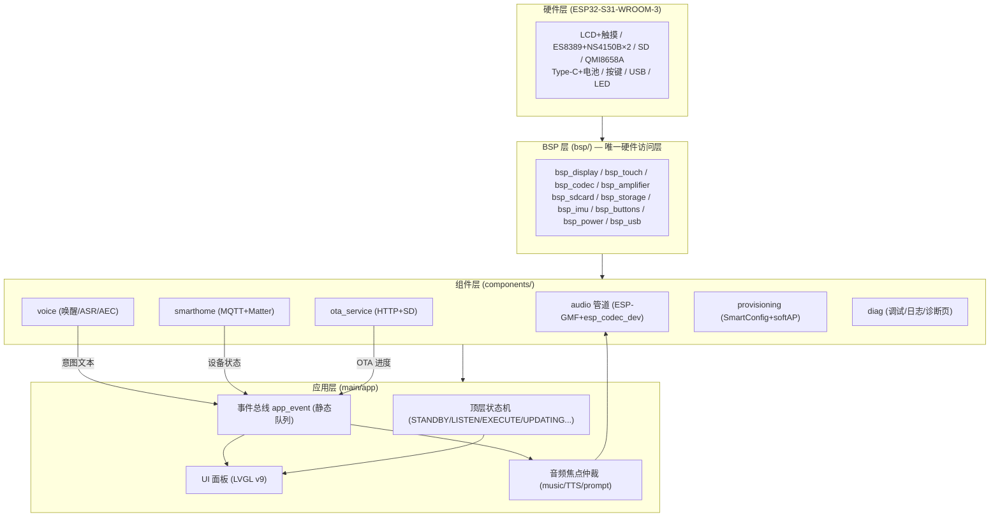
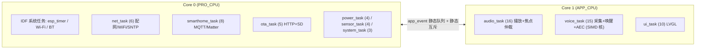

# Lero Voice 项目方案（v3.3）

> **Lero — Let your voice talk.** 🔊
> 一个开源的智能 AI 音箱项目：搭载屏幕、立体声喇叭、双麦克风、SD 卡扩展与电池供电，
> 目标是打造属于你自己的 AI 语音助手 + 智能家居控制中枢 —— 就像《钢铁侠》里的贾维斯。

| 项目 | 内容 |
|------|------|
| 文档版本 | v3.3（2026） |
| 依据 | 原理图 `docs/SCH_Schematic1_1_2026-08-25.pdf`（引脚映射逐网络核实）、ESP32-S31 官方产品页与数据手册、ESP 组件库现状 |
| 状态 | 硬件选型 ✅ 原理图 ✅ → PCB 进行中 / BSP 待启动 |

---

## 目录

- [1. 项目定位](#1-项目定位)
- [2. 硬件架构（含逐模块引脚表）](#2-硬件架构含逐模块引脚表)
- [3. 软件架构](#3-软件架构)
- [4. 配网方案（详细步骤）](#4-配网方案详细步骤)
- [5. 显示方案](#5-显示方案)
- [6. 音频方案](#6-音频方案)
- [7. 智能家居控制方案](#7-智能家居控制方案)
- [8. OTA 升级方案（分区表 + HTTP + SD 双通道 + 用户确认）](#8-ota-升级方案分区表--http--sd-双通道-用户确认)
- [9. 开发环境搭建](#9-开发环境搭建)
- [10. 里程碑](#10-里程碑)
- [11. 风险与待定项](#11-风险与待定项)
- [12. 资料清单（本项目使用）](#12-资料清单本项目使用)

---

## 1. 项目定位

**目标用户**：桌面 / 便携场景，需要 AI 语音助手 + 蓝牙音箱 + 智能家居控制 + 信息展示的用户。

**核心卖点**：

- 🧠 **AI 语音助手**：ESP32-S31 支持 ESP Private Agents / 直连 LLM，可做唤醒词 + 云端大模型对话
- 🏠 **智能家居控制**：MQTT（Home Assistant 等生态）+ Matter（Apple/Google/Alexa），语音与屏幕双入口控制灯光、开关、空调等
- 🔊 **立体声音箱**：ES8389 + 双 NS4150B（3 W×2），支持蓝牙经典（BR/EDR）与 **BLE Audio（LC3）** 播放
- 🖥️ **带屏交互**：RGB 并口 LCD + 电容触摸，LVGL v9 界面
- 🎙️ **双麦克风**：立体声模拟麦输入，为语音识别 / 回声消除留出通道
- 💾 **SD 卡扩展**：本地音乐 / 录音 / 资源存储 / **本地 OTA 固件**
- 🔋 **电池供电 + Type-C 充电**：桌面、户外均可用
- 🔄 **双通道 OTA**：HTTP（GitHub Releases）+ SD 卡本地升级

**非目标（本期不做）**：4G/5G 蜂窝、GPS 导航、Matter/Thread 边界路由器。

---

## 2. 硬件架构（含逐模块引脚表）

### 2.1 核心器件清单（已按原理图核实）

| 组件 | 型号 | 说明 | 状态 |
|------|------|------|------|
| **主控模块** | **ESP32-S31-WROOM-3-N16R16V** | RISC-V 双核 @ 320 MHz，16 MB Flash + 16 MB PSRAM，Wi-Fi 6 (802.11ax) + BLE 5.4 (LE Audio) + 802.15.4 + 千兆以太网 MAC，60 GPIO（模块引出 54），512 KB SRAM，最高 +85 °C | ✅ 已量产（2026-07） |
| **音频 Codec** | **ES8389** | 24-bit / 8–96 kHz，DAC SNR 110 dB，立体声 ADC/DAC，双模拟麦输入，支持 DMIC 模式 | ✅ 原理图 U7 |
| **音频功放** | **NS4150B × 2** | 3 W D 类功放，左右声道独立，CTRL 引脚使能（PA_CTRL） | ✅ 原理图 U10/U11 |
| **屏幕** | 40-Pin RGB 并口 LCD（FPC：AFC24-S40FIA-00，0.5 mm 40P） | 18-bit RGB（DB0~DB17）+ DE/PCLK/HS/VS/RESET，背光 LEDA/LEDK，电容触摸（I2C） | ⚠️ **分辨率待确认** |
| **麦克风** | 模拟麦克风 × 2（MIC1P/N、MIC2P/N → ES8389） | 型号待定（原理图已预留 0 Ω 选焊电阻） | ⚠️ 型号待定 |
| **SD 卡** | MicroSD 卡座 XKTF-001B | 4-bit SDIO（SD_D0~D3/CLK/CMD）+ 卡检测 SD_DET | ✅ |
| **IMU** | QMI8658A | 6 轴惯性测量，I2C 地址 0x6A，INT1/INT2 中断 —— 屏幕方向 / 手势唤醒 | ✅ 原理图 U12 |
| **电池管理** | LGS5500EP | 锂电池线性充电 + NTC + 充电指示灯（LED_BAT） | ✅ 原理图 U1 |
| **电源** | SY8089AA（DC-DC）、ME6211C33M5G-N（3.3V LDO）、CODEC LDO（AUD_3V3） | 多路电源树，音频单独 LDO | ✅ |
| **背光驱动** | MP3302DJ-LF-Z | LED 背光升压驱动（ISET/VSET 可调） | ✅ 原理图 U4 |
| **USB** | Type-C 16P + SY6280AAC 负载开关 | 充电 + USB 数据（USB1_DP/DM），带 ESD 防护 | ✅ |
| **按键** | EN（SW1）、BOOT（SW2）+ 功能键 ×3（SW3~5） | 系统键 + 用户键（详见 2.4） | ✅ |

> 📌 数据手册文件已归档：`docs/esp32-s31-wroom-3_datasheet_cn.pdf`

### 2.2 系统框图

```
                        ┌──────────────────────────────────────────┐
  USB Type-C ──┬──► SY8089(DC-DC) ──► ME6211(3V3) ──► 3V3 系统电源
               │        │
               └──► LGS5500EP(充电) ──► 锂电池 ──► AO3401A(电源路径)
                    NTC / BAT_ADC / BUS_ADC / LED_BAT
                        │
  ┌─────────────────────┼──────────────────────────────────────────┐
  │  ESP32-S31-WROOM-3-N16R16V                                    │
  │                                                                │
  │  I2S(SCLK/LRCK/SDOUT/DSDIN) ──► ES8389 ──► NS4150B ×2 ──► 喇叭 L/R │
  │  I2C0(SDA=IO0/SCL=IO1) ──► ES8389(0x20) / QMI8658A(0x6A)        │
  │  I2C1(SDA=IO46/SCL=IO47) ──► 触摸屏(TP_INT=IO2)               │
  │  RGB18(DB0~17=IO7~19/33~35/38~39, DE/PCLK/HS/VS/RESET) ──► LCD │
  │  SDIO(4-bit) + SD_DET ──► MicroSD                              │
  │  USB1_DP/DM ──► Type-C(数据) / USB_EN=IO53 ──► SY6280AAC        │
  │  IO55/56/57 ──► 功能键   BOOT=IO61 / EN ──► SW2/SW1            │
  │  TX0/RX0 ──► CN2(调试串口)                                      │
  └────────────────────────────────────────────────────────────────┘
```

### 2.3 电源树（按原理图网络）

| 网络 | 来源 | 去向 |
|------|------|------|
| VBUS / USB_5V | Type-C 5V（带 ESD 与防倒灌） | SY8089、LGS5500EP、SY6280AAC |
| 5V | SY8089AA DC-DC（L3=4.7 µH） | 功放等 |
| 3V3 | ME6211 LDO | 模块、SD、触摸、IMU |
| AUD_3V3 | 音频专用 LDO（CODEC_LDO） | ES8389 AVDD/PVDD/DVDD —— **干净电源，避免数字噪声耦合** |
| VBAT | 锂电池 | 全系统（经 AO3401A 电源路径） |
| BAT_ADC / BUS_ADC | 分压采样 → IO50 / IO51 | 电量与总线电压监测 |

### 2.4 引脚分配表（逐模块，已按原理图逐网络核实）

> 模块引脚号 = ESP32-S31-WROOM-3 封装引脚（与数据手册编号一致）；"网络名"即原理图标注。

#### 2.4.1 音频（ES8389 + NS4150B）

| 信号 | 网络名 | 模块引脚 | GPIO | 备注 |
|------|--------|:--------:|:----:|------|
| I2S 位时钟 | I2S_SCLK | 7 | **IO3** | |
| I2S 帧同步 | I2S_LRCK | 10 | **IO4** | |
| I2S 数据输出（录音） | I2S_SDOUT | 11 | **IO5** | ES8389 → SoC |
| I2S 数据输入（播放） | I2S_DSDIN | 12 | **IO6** | SoC → ES8389 |
| I2S 主时钟 | I2S_MCLK | — | ⚠️ **未接主控** | 见 2.6 核对记录 |
| I2C 数据 | SDA | 8 | **IO0** | ES8389(0x20) + QMI8658A(0x6A) 共用 |
| I2C 时钟 | SCL | 9 | **IO1** | 同上 |
| 功放使能 | PA_CTRL | 62 | **IO52** | NS4150B CTRL ×2 |

#### 2.4.2 屏幕（RGB 18-bit 并口）

| 信号 | 网络名 | 模块引脚 | GPIO |
|------|--------|:--------:|:----:|
| 数据 DB0~DB12 | DB0~DB12 | 13~25 | **IO7~IO19** |
| 数据 DB13 / DB14 / DB15 | DB13/14/15 | 42 / 43 / 44 | **IO33 / IO34 / IO35** |
| 数据 DB16 / DB17 | DB16/17 | 49 / 50 | **IO38 / IO39** |
| 像素时钟 | LCD_PCLK | 51 | **IO40** |
| 数据使能 | LCD_DE | 52 | **IO42** |
| 复位 | LCD_RESET | 53 | **IO43** |
| 行同步 | LCD_HS | 54 | **IO44** |
| 帧同步 | LCD_VS | 55 | **IO45** |
| 背光使能/PWM | BL_EN | 64 | **IO54** | MP3302 驱动 |

#### 2.4.3 触摸屏（电容触摸，I2C）

| 信号 | 网络名 | 模块引脚 | GPIO |
|------|--------|:--------:|:----:|
| I2C 数据 | TP_SDA | 56 | **IO46** |
| I2C 时钟 | TP_SCL | 57 | **IO47** |
| 中断 | TP_INT | 6 | **IO2** |
| 复位 | TP_RST | 58 | **IO48**（原理图标注 IO49，疑误，见 2.6） |

#### 2.4.4 SD 卡（SDIO 4-bit）

| 信号 | 网络名 | 模块引脚 | GPIO |
|------|--------|:--------:|:----:|
| 数据 / 时钟 / 命令 | SD_D0~D3 / SD_CLK / SD_CMD | 27~32 | 模块专用 SD 引脚 |
| 卡检测 | SD_DET | — | ⚠️ **未接主控** | 见 2.6 核对记录 |

#### 2.4.5 按键

| 按键 | 网络名 | 模块引脚 | GPIO | 说明 |
|------|--------|:--------:|:----:|------|
| SW1 | EN | 5 | EN | 复位键 |
| SW2 | BOOT | 71 | **IO61** | 引导模式键（非传统 IO0，见 2.6） |
| SW3 | IO55 | 65 | **IO55** | 功能键 1（10k 上拉 + 100nF 消抖） |
| SW4 | IO56 | 66 | **IO56** | 功能键 2 |
| SW5 | IO57 | 67 | **IO57** | 功能键 3 |

#### 2.4.6 USB

| 信号 | 网络名 | 模块引脚 | GPIO |
|------|--------|:--------:|:----:|
| USB 数据 + / − | USB1_DP / USB1_DM | 40 / 41 | USB_DP / USB_DM |
| USB 负载开关使能 | USB_EN | 63 | **IO53** | SY6280AAC |

#### 2.4.7 电源 / 状态

| 信号 | 网络名 | 模块引脚 | GPIO | 说明 |
|------|--------|:--------:|:----:|------|
| 电池电压采样 | BAT_ADC | 60 | **IO50** | |
| 总线电压采样 | BUS_ADC | 61 | **IO51** | |
| 指示灯控制 | DE | 59 | **IO49** | 连接电源页 LED1 电路（5V→1k→LED1→IO49，低电平点亮，用途待核实） |
| 充电指示 / NTC | LED_BAT / NTC | — | — | 由充电芯片 LGS5500EP 直驱，不占 GPIO |

#### 2.4.8 调试 / 未用引脚

| 信号 | 模块引脚 | GPIO | 说明 |
|------|:--------:|:----:|------|
| 串口 TX / RX | 68 / 69 | TX0 / RX0 | CN2 调试口 |
| IO60 | 70 | IO60 | 悬空（备用/测试点） |
| IO36 / IO37 | 45 / 46 | IO36 / IO37 | **未连接，可作扩展**（如红外发射等） |

> **I2C 总线划分**：I2C0（SDA=IO0 / SCL=IO1）→ ES8389 + QMI8658A；I2C1（SDA=IO46 / SCL=IO47）→ 触摸屏。两条总线独立。

### 2.5 硬件设计注意事项

1. **音频电源**：ES8389 使用独立 AUD_3V3（LDO 供电），模拟地 AGND 与数字地 DGND 单点连接
2. **I2S 走线**：尽量等长、远离开关电源与 LCD 数据线
3. **功放**：NS4150B 靠近喇叭接口，输出 LC 滤波靠近芯片，注意 3 W×2 连续输出时的热耗与电池放电能力
4. **天线净空**：模块 PCB 天线区域禁铺铜、禁走线（外壳件注意避开金属件）
5. **高温环境**：模块工作温度 -40~+85 °C（Mouser 标称）；连续播放时评估整机温升，外壳开散热孔
6. **静电防护**：USB/按键/喇叭接口均已有 ESD 器件（LESD5D5.0CT1G 等），PCB 布局时 ESD 器件靠近接口
7. **PCB 阶段**：嘉立创 EDA 工程归档至 `hardware/schematics/`；模块封装可直接用乐鑫官方 DXF/STEP（`ESP32-S31-WROOM-3` footprint + 3D 模型），3D 模型同时用于外壳设计

### 2.6 原理图核对记录（2026-08-25 版，从 PDF 逐网络提取）

| # | 发现 | 影响 / 行动 |
|---|------|-------------|
| 1 | ⚠️ **I2S_MCLK 未连接到主控**：该网络只存在于音频页（接 ES8389 MCLK 引脚、C57 22pF、R54 100k），未接到模块任何 GPIO | ES8389 需要 MCLK 才能工作。需补连：选一个空闲 GPIO 输出 MCLK（如 IO36/IO37），或确认模块是否内置 MCLK 输出 |
| 2 | ⚠️ **SD_DET 未接入主控**：卡检测信号只在卡座端有网络名，未连到模块 | 卡检测功能不可用。如需热插拔检测，补连 IO36/IO37 之一 |
| 3 | ⚠️ **模块引脚 58/59 标注重复**：两脚均标 "IO49"（疑为 IO48/IO49），触摸复位 TP_RST 与指示灯 DE 分别接此两脚 | 与数据手册引脚图核对后修正符号；BSP 中按核实结果配置 |
| 4 | **BOOT 按键接 IO61 而非 IO0**（IO0 被用作 SDA） | S31 引导 strapping 引脚以数据手册为准；确认 IO61 是否可触发下载模式，否则下载模式需另留入口 |
| 5 | IO36 / IO37、IO60 未使用 | 可作为 MCLK / SD_DET / 红外发射等扩展资源 |
| 6 | ⚠️ **IMU 中断未接主控**：QMI8658A 的 INT1/INT2 引脚无网络（仅 SDA/SCL/3V3/GND） | IMU 只能轮询读取，无法中断唤醒 / 手势中断；BSP 按轮询设计（后续要手势唤醒需改版补连） |
| 7 | ⚠️ **IMU 地址脚 SA0 悬空**：SDO/SA0 未接，地址依赖内部默认（原理图标注 0x6A） | BSP 初始化时先探测 0x6A / 0x68 两个地址再锁定 |

---

## 3. 软件架构

### 3.1 技术选型总览（已按 S31 生态修正）

| 功能模块 | 选型方案 | 说明 |
|----------|----------|------|
| **核心框架** | **ESP-IDF v6.1+**（target: `esp32s31`） | esp32s31 支持的最低版本线（**v6.0 全系无 S31 工具链**） |
| **音频框架** | **ESP-GMF**（`espressif/esp-gmf`）+ **esp_codec_dev** | S31 官方多媒体框架；**ES8389 已被 esp_codec_dev ≥ v1.3.6 官方支持（播放+录音）** |
| **蓝牙音频** | ESP-BLE-AUDIO / BT Classic | S31 原生支持 **BLE Audio（LC3）** 与蓝牙经典 A2DP |
| **显示框架** | LVGL v9 + **esp_lvgl_port** | 乐鑫官方适配组件（注意：不是"esp_lvgl_adapter"） |
| **UI 设计工具** | SquareLine Studio | 拖拽生成 LVGL 代码，免费版支持 LVGL v9 |
| **配网方案** | SmartConfig（ESP-TOUCH v2）+ 微信小程序 | 一键配网；softAP 兜底 |
| **智能家居** | **esp-mqtt**（Home Assistant 等）+ **ESP-Matter** | MQTT 为主力通道，Matter 接入主流生态（见第 7 章） |
| **OTA 升级** | esp_ghota（HTTP）+ SD 卡本地升级 | 双通道，共用 ota_service 组件 |
| **语音唤醒** | ESP-SR / ESP Private Agents（待确认 S31 支持矩阵） | 参考 Korvo-1 双麦阵列方案 |

### 3.2 项目目录结构

```
Lero-Voice/                    # 仓库根 = ESP-IDF 工程（target: esp32s31）
├── main/                      # 主入口（main.c：nvs → bsp_init → diag/prov/ota → 静态任务）
├── components/                # 组件（各自独立、可测试）
│   ├── bsp/                   # ★ BSP：唯一接触硬件外设的层（见 3.3）
│   │   ├── bsp_config.h       # 唯一板级适配点：引脚映射 / 外设参数 / 缓冲区大小
│   │   └── bsp_*.c/.h         # display / touch / codec / amplifier / sdcard / imu / buttons / power / storage / usb
│   ├── ota_service/           # 双通道 OTA（HTTP + SD）+ 用户确认（见第 8 章）
│   ├── provisioning/          # SmartConfig + softAP 配网（见第 4 章）
│   ├── diag/                  # 调试诊断：console / 日志落盘 / 诊断页 / coredump（见 3.8）
│   ├── player/                # SD 卡音乐播放：ESP-GMF + ES8389（见 6.2）
│   ├── smarthome/             # 智能家居：MQTT + Matter + 意图解析（规划，见第 7 章）
│   └── voice/                 # 语音助手骨架：采集/VAD/上传接口/唤醒占位（见 3.9）
├── partitions.csv             # OTA 分区表（见 8.1）
├── CMakeLists.txt             # PROJECT_VER=0.1.0（OTA 版本比较基准）
├── sdkconfig.defaults         # 静态分配 / 分区 / 日志等默认配置
├── sdkconfig.ci               # CI 构建配置
├── hardware/                  # 硬件设计（规划：嘉立创工程归档）
│   ├── schematics/            # 原理图源文件（导出自 2026-08-25 版）
│   └── pcb/                   # PCB 文件
├── docs/                      # 方案 / 数据手册 / 原理图 PDF / 参考 SDK
├── models/                    # 3D 打印外壳
├── assets/                    # 图片 / UI 资源 / 音频
├── .github/workflows/build.yml# CI/CD 自动构建 + Release + 静态检查
├── LICENSE                    # MIT
└── README.md
```

### 3.3 BSP 设计（先行开发）

> 原则：**BSP 先行，应用后置**。BSP 是唯一接触硬件外设的层；应用层只调用 BSP 接口，不直接访问寄存器/驱动。
> 换板只需改 `bsp_config.h` 与对应 `bsp_*.c`，应用与组件零改动。引脚映射以 2.4 节为准。

```
components/bsp/
├── bsp_config.h         # ★ 板级配置：GPIO 映射 / I2C 地址 / I2S 参数 / 静态缓冲区大小
├── bsp.h / bsp.c        # bsp_init()：按序初始化全部外设；bsp_deinit()
├── bsp_display.c/.h     # LCD（esp_lcd RGB 并口，IO7~19/33~35/38~45）+ 背光 PWM（BL_EN=IO54）
├── bsp_touch.c/.h       # 电容触摸（esp_lcd_touch → LVGL 输入；I2C1=IO46/47，INT=IO2）
├── bsp_codec.c/.h       # ES8389 播放/录音（esp_codec_dev；I2S=IO3~6，I2C0=IO0/1）
├── bsp_amplifier.c/.h   # NS4150B 使能/静音（PA_CTRL=IO52）
├── bsp_sdcard.c/.h      # SDIO 4-bit 挂载/卸载（模块专用 SD 引脚）
├── bsp_imu.c/.h         # QMI8658A 初始化/读取（I2C0，0x6A）
├── bsp_buttons.c/.h     # 按键扫描：消抖 / 短按 / 长按（IO55/56/57）
├── bsp_power.c/.h       # 电池电压（BAT_ADC=IO50）/ 总线电压（BUS_ADC=IO51）/ 指示灯（IO49）
├── bsp_storage.c/.h     # storage 分区挂载（SPIFFS）：UI 资源 / 设备表 / OTA 暂存
└── bsp_usb.c/.h         # USB_EN=IO53 负载开关（USB 功能切换）
```

| BSP 模块 | 硬件 | 对外接口（示意） | 依赖组件 |
|----------|------|------------------|----------|
| bsp_display | LCD + 背光 | `bsp_display_init()` / `bsp_display_get_lcd_handle()` / `bsp_display_backlight_set(pct)` | esp_lcd、esp_lvgl_port |
| bsp_touch | 触摸屏 | `bsp_touch_init()` / `bsp_touch_get_handle()` | esp_lcd_touch |
| bsp_codec | ES8389 | `bsp_codec_init()` / `bsp_codec_play()` / `bsp_codec_record()` / `bsp_codec_volume_set()` | esp_codec_dev |
| bsp_amplifier | NS4150B×2 | `bsp_amp_enable(on)` / `bsp_amp_mute(mute)` | GPIO |
| bsp_sdcard | MicroSD | `bsp_sdcard_init()` / `bsp_sdcard_mount()` / `bsp_sdcard_unmount()` | sdmmc + FATFS |
| bsp_imu | QMI8658A | `bsp_imu_init()` / `bsp_imu_read_accel()` / `bsp_imu_read_gyro()` | I2C |
| bsp_buttons | SW3~5 | `bsp_buttons_init(cb)` / 事件：短按/长按 | GPIO + 定时器 |
| bsp_power | 电池/NTC | `bsp_power_init()` / `bsp_power_get_battery_mv()` / `bsp_power_get_temp()` | ADC |
| bsp_storage | storage 分区 | `bsp_storage_init()` / `bsp_storage_mount()` / `bsp_storage_info()` | SPIFFS |
| bsp_usb | USB_EN | `bsp_usb_enable(on)` | GPIO |

**BSP 开发顺序**（每步可独立验证）：

1. `bsp_config.h` + `bsp_init()` 骨架 + 电源/按键 + 串口日志（点亮最小系统）
2. `bsp_display` + `bsp_touch`（跑通 LVGL 画面与触摸）
3. `bsp_codec` + `bsp_amplifier`（立体声播放 → 双麦录音；注意先补 MCLK 连接，见 2.6）
4. `bsp_sdcard` + `bsp_storage`（挂载/读写，为 OTA 与本地音乐铺路）
5. `bsp_imu`（轮询模式，见 2.6）/ `bsp_power` / `bsp_usb`（外设补齐）

### 3.3.1 BSP 设计审查结论（v3.1 修订，逐项核实原理图后）

| # | 审查发现 | 修订 |
|---|----------|------|
| 1 | 原 BSP 缺 **storage 文件系统模块**：UI 资源、唤醒词、设备映射表、OTA 暂存都需要 storage 分区 | 新增 `bsp_storage`（SPIFFS 挂载/格式化/空间查询），开发顺序第 4 步 |
| 2 | **背光时序**：`bsp_display_init` 若立即点亮背光，首帧渲染前会白屏 | 约定：背光默认关闭，UI 首帧渲染完成才 `bsp_display_backlight_set(>0)` |
| 3 | **功放防爆音**：codec 与 amplifier 分离但无时序约定 | 约定：上电顺序 = codec 初始化 → PA 保持静音 → 首次播放前才 `bsp_amp_enable`；音源切换先 mute 再操作 |
| 4 | **RGB 帧缓冲静态化**：无动态内存约束下，帧缓冲必须静态分配进 PSRAM | 用 `EXT_RAM_BSS_ATTR`（或链接段）声明静态数组，传入 `esp_lcd_rgb_panel_config_t.buf1/.buf2`；按 480×854×2B×2 帧 ≈ 1.6 MB 预算 |
| 5 | **充电状态盲区**：LGS5500EP 无 I2C，LED_BAT 由充电芯片直驱，固件读不到 | `bsp_power_get_charge_state()` 用 BUS_ADC 电压 + BAT 电压变化率推断；改版时可将 LED_BAT 兼接 GPIO 输入 |
| 6 | **SD_DET 未接主控**（见 2.6） | `bsp_sdcard` 不做中断热插拔，改为：轮询挂载状态 / 界面按钮触发 |
| 7 | **IMU 中断未接 + SA0 悬空**（见 2.6） | `bsp_imu` 轮询模式；初始化先探测 0x6A/0x68 地址 |
| 8 | **USB_EN 时序未定义** | 约定：进入 USB 功能时 `bsp_usb_enable(true)`，默认关闭省电 |
| 9 | **bsp_init 失败处理** | 逐外设返回 `esp_err_t`，允许部分失败（如无 SD 卡不阻塞启动）；记录失败位图供诊断页显示 |
| 10 | **低功耗钩子缺失** | `bsp_power` 提供 sleep 钩子（息屏 / Light Sleep 进出回调），待机策略在 system 层编排 |

### 3.4 代码规范（参照汽车工业标准）

> 目标基线：**MISRA C:2012**（应用/BSP/自有组件强制子集），命名与分层参考 **AUTOSAR** 风格。

**必守规则（自有代码：`main/`、`bsp/`、`components/`）**

| # | 规则 | 说明 |
|---|------|------|
| 1 | **禁止动态内存分配** | 禁用 `malloc/calloc/realloc/free`（MISRA C:2012 规则 21.3）与 `new/delete`；不使用 `HeapCaps_malloc` 等堆接口 |
| 2 | **静态分配** | FreeRTOS 全部使用静态 API：`xTaskCreateStaticPinnedToCore` / `xQueueCreateStatic` / `xSemaphoreCreateBinaryStatic` 等（`configSUPPORT_STATIC_ALLOCATION=1`）；任务栈、队列、缓冲区均为编译期静态数组（栈可用 PSRAM 段） |
| 3 | **LVGL 静态池** | LVGL 默认使用内部静态堆（`LV_MEM_SIZE` 配置，非 malloc）；保持 `LV_MEM_CUSTOM=0`，按 PSRAM 预算规划池大小 |
| 4 | **框架例外声明** | ESP-IDF 框架与第三方组件内部实现不在约束范围（如 WiFi/TLS 内部堆使用）；约束仅针对本项目自有代码 |
| 5 | 声明与定义 | 外部对象必须有头文件声明（MISRA 8.x）；头文件单一职责、包含守卫 `#ifndef BSP_XXX_H` |
| 6 | 类型安全 | 本质类型规则（MISRA 10.x）：不混用有符号/无符号、`int` 与 `enum` 不加隐式转换；长度用 `size_t`，错误用 `esp_err_t` |
| 7 | 控制流 | 循环/分支结构清晰（MISRA 15.x/16.x）；`switch` 每个 case 必带 `break`；函数单一出口（MISRA 15.5） |
| 8 | 函数 | 参数与返回值显式声明（MISRA 17.x）；返回值必须被检查（`esp_err_t` 不吞错）；函数体 ≤ 60 行（项目约定） |
| 9 | 错误处理 | 初始化失败分级：可恢复（返回错误码重试）与致命（`ESP_LOGE` + 明确动作）；禁止空 `catch`/吞错 |
| 10 | 命名 | 模块前缀（`bsp_`/`ota_`/`net_`/`ui_`/`sh_`）；函数 `模块_动作_对象`；类型 `_t` 后缀；宏与常量全大写；全局变量 `g_` 前缀；文件内静态 `s_` 前缀 |
| 11 | 日志 | `ESP_LOGD/E/I/W` 分级，tag 统一为模块名；发布构建关闭 DEBUG 日志 |

**工程落地**：CI 中静态检查 `cppcheck --addon=misra` + GCC `-Wall -Wextra -Werror`（自有代码目录）；可选商业工具 PC-lint / LDRA 提升覆盖；公共 API 使用 Doxygen 注释。

### 3.5 RTOS 任务划分、优先级与双核分配（审查后修订）

> 平台事实（来自 ESP-IDF esp32s31 官方文档）：
> - S31 双核 SMP，IDF FreeRTOS 中 **Core 0 = PRO_CPU（协议栈亲和）**、**Core 1 = APP_CPU（应用亲和）**；协议任务（Wi-Fi/BT 等）默认绑 Core 0
> - 静态 + 核绑定创建：`xTaskCreateStaticPinnedToCore()`；`tskNO_AFFINITY` = 不绑定（两核均可运行）；IDF 中任务栈单位是**字节**
> - 调度规则：**每核独立调度**，选本核可运行的最高优先级就绪任务；同优先级 best-effort 轮转；**Core 0 独占 tick 计时**（不要让 Core 0 长时间被高优先级任务占死）
> - 硬件上其中一个核带 **128-bit SIMD 数据通路**（产品页），语音 DSP/AEC 若走 SIMD 加速库，把处理任务固定到该核（以数据手册核编号为准，预留 `CONFIG_LERO_VOICE_CORE` 宏切换）

#### 3.5.1 任务总表（优先级、核绑定、静态栈预算）

| 任务 | 职责 | 优先级 | 核 | 栈(初始预算) | 触发方式 |
|------|------|:------:|:--:|:------------:|----------|
| `audio_task` | ESP-GMF 播放管道（解码→I2S→DAC）、音频焦点仲裁（music/TTS/prompt）、AEC 参考注入 | **16** | **Core 1** | 8 KB | 事件队列（播放/停止/音量） |
| `voice_task` | 录音采集（I2S→ADC）、VAD、上传传输（骨架已建，见 3.9）；唤醒/AEC 待 ESP-SR | **15** | **Core 1** | 12 KB | 采集帧驱动 + 事件 |
| `ui_task` | LVGL 刷新（lv_timer_handler）、首帧背光点亮、界面状态更新 | **10** | **Core 1** | 8 KB | 事件总线 + lvgl_port |
| `smarthome_task` | MQTT 收发/重连、Matter 事件、意图执行、HA Discovery | **8** | **Core 0** | 8 KB | MQTT 回调入队 + 定时 |
| `net_task` | WiFi 连接管理、SmartConfig、softAP、SNTP、断线重连 | **6** | **Core 0** | 6 KB | 事件 + 状态机 |
| `ota_task` | HTTP/SD 双通道 OTA：检查→元信息校验→下载/读取→校验→**待用户确认**→切换；电量门槛 | **5** | **Core 0** | 6 KB | 定时(1h) + 事件触发 |
| `sensor_task` | QMI8658A 轮询（无中断，见 2.6）、手势/方向计算 | **3** | **Core 0** | 4 KB | 定时 50 ms |
| `power_task` | BAT_ADC/BUS_ADC/NTC 采样、充电状态推断、低电量告警、sleep 编排 | **4** | **Core 0** | 4 KB | 定时 2 s |
| `system_task` | 按键事件分发（短按/长按）、状态灯（IO49）模式、恢复出厂、看门狗 | **2** | Core 0 | 4 KB | 事件队列 |
| `diag_task` | 调试控制台 REPL、日志落盘、状态快照采样（1 s）、故障位图维护 | **1** | Core 0 | 4 KB | 串口输入 + 定时 |
| （IDF 系统任务） | esp_timer / Wi-Fi / BT / IPC / MQTT 库内部 | 高 | Core 0 | 框架管理 | — |

> 优先级说明：应用任务建议区间 **1~18**（最低 1 留给诊断任务，保证业务任务不饥饿），全部低于 IDF 系统任务（esp_timer/Wi-Fi/BT 等高位）；**同核任务优先级全局唯一、错开 1~2 档**，避免同优先级轮转抖动。数值为初始建议，M4 BSP 阶段用 `uxTaskGetStackHighWaterMark` 实测校准。

#### 3.5.2 是否需要核绑定？—— 需要，按矩阵绑定

| 绑定决策 | 理由 |
|----------|------|
| audio / voice / ui → **Core 1** | 媒体等时性：解码/采集/刷屏不被 WiFi 中断抖动打断；三者同核避免跨核同步开销 |
| net / smarthome / ota / sensor / power / system → **Core 0** | 与协议栈（Wi-Fi/BT 本就绑 Core 0）同核，MQTT/Matter 就近网络事件；Core 0 负责 tick 计时，不放重负载 |
| 全部使用 `xTaskCreateStaticPinnedToCore`（静态栈 + 显式核） | 满足"无动态内存"规则，且任务归属一目了然；不依赖 `tskNO_AFFINITY` 的隐性调度 |
| 异常处理任务（如错误码集中上报）可 `tskNO_AFFINITY` | 低频、无实时要求，让调度器自由平衡 |

> 反例警示（IDF 文档）：若 A(pri=10, Core0)、B(pri=9, Core0)、C(pri=8, Core1)，则 B 永不运行 —— **同核任务优先级必须全局错开**，表中已按此设计。

#### 3.5.3 事件总线与协作规则（防并发纰漏）

```
app_event 静态队列（固定 16 槽，事件结构体定长）：
  按键事件 / 网络状态 / MQTT 消息 / OTA 进度·待确认·结果 / 意图结果 / 低电量 / 定时器心跳
  生产者: ISR(仅入队)、各任务、MQTT 回调(仅入队，禁止阻塞/做重活)
  消费者: ui_task(界面)、system_task(灯/键)、audio_task(焦点)、voice_task(意图)
```

| # | 规则 | 说明 |
|---|------|------|
| 1 | **LVGL 单线程** | 所有 `lv_*` 调用只在 `ui_task`（持 lvgl_port 锁）；其他任务要更新界面 → 发事件，禁止直接碰 LVGL |
| 2 | **codec 双工所有权** | `audio_task` 拥有播放会话、`voice_task` 拥有录音会话（esp_codec_dev 支持 IN_OUT 双工）；采样率/通道变更前先停会话，经事件协调 |
| 3 | **回调只入队** | MQTT 回调、按键 ISR、驱动回调内只做 `xQueueSendFromISR`/入队，绝不阻塞、不调 BSP/文件系统 |
| 4 | **SPIFFS 互斥** | `bsp_storage` 非线程安全：文件访问加静态互斥，且只允许 ota / smarthome / ui(资源加载) 三处低频使用 |
| 5 | **音频焦点** | 三档：`music`(可被夺) / `tts`(语音反馈) / `prompt`(提示音)；TTS 打断 music 自动 ducking；语音对话中暂停 music |
| 6 | **NVS 短事务** | NVS 读写只在对应任务内完成，不跨任务持有 |

#### 3.5.4 运行状态机（顶层）

```
POWER_ON → bsp_init → 自检(失败位图→诊断页)
  → 配置检查: 有 WiFi 配置? ──否──► PROVISIONING(配网/SmartConfig/softAP)
        └─是─► STANDBY(待机: 唤醒词常听 + 息屏 + 省电)
                 ├─唤醒词/按键► LISTEN(对话/意图) ─► EXECUTE(播放TTS/控制设备) ─► STANDBY
                 ├─蓝牙连接 ► BT_AUDIO(播放) ─► STANDBY
                 ├─OTA 触发 ► UPDATING(检查/下载/校验) ─► PENDING_APPLY(弹窗/语音确认) ─确认─► 3s倒计时 ─► REBOOT
                 └─低电量 ► LOW_BATTERY(告警→自动关机阈值)
```

### 3.6 关键集成代码

**显示（LVGL v9 + esp_lvgl_port，真实 API）**

```c
// idf.py add-dependency "lvgl/lvgl^9.2.0"
// idf.py add-dependency "espressif/esp_lvgl_port^2.3.0"

#include "esp_lvgl_port.h"

const lvgl_port_cfg_t lvgl_cfg = ESP_LVGL_PORT_INIT_CONFIG();
lvgl_port_init(&lvgl_cfg);
// esp_lcd RGB 面板初始化后：
lvgl_port_display_cfg_t disp_cfg = { ... };   // 分辨率/颜色格式等
lvgl_port_add_disp(&disp_cfg);
// 触摸 (esp_lcd_touch) 初始化后：
lvgl_port_touch_cfg_t touch_cfg = { ... };
lvgl_port_add_touch(&touch_cfg);
```

**音频（esp_codec_dev + ES8389，esp_codec_dev ≥ v1.3.6 已官方支持）**

```c
#include "esp_codec_dev.h"
#include "es8389_codec.h"

// 1. I2S 数据接口 (audio_codec_data_if_t)
audio_codec_data_if_t *data_if = audio_codec_new_i2s_data(&i2s_cfg);
// 2. ES8389 控制接口 (I2C, 地址 0x20)
const audio_codec_ctrl_if_t *ctrl_if = es8389_codec_new(&es8389_cfg);
// 3. 注册编解码设备 (播放 + 录音)
esp_codec_dev_cfg_t dev_cfg = {
    .codec_if = ctrl_if,
    .data_if = data_if,
    .dev_type = ESP_CODEC_DEV_TYPE_IN_OUT,
};
esp_codec_dev_handle_t codec = esp_codec_dev_new(&dev_cfg);

esp_codec_dev_set_out_vol(codec, 60.0);            // 音量
esp_codec_dev_sample_info_t fs = { .sample_rate = 48000, .channel = 2, .bits_per_sample = 16 };
esp_codec_dev_open(codec, &fs);
esp_codec_dev_write(codec, pcm, len);              // 播放
esp_codec_dev_read(codec, buf, len);               // 录音
```

> 解码（MP3/AAC/FLAC）与播放链路用 **ESP-GMF** 的 element 管道组装；具体 API 以 ESP-GMF 文档为准。

**任务创建（静态栈 + 核绑定，对应 3.5）**

```c
// 栈与 TCB 静态分配（栈可放 PSRAM 段：EXT_RAM_BSS_ATTR）
static StackType_t  s_audio_stack[8192 / sizeof(StackType_t)];   // 8 KB
static StaticTask_t s_audio_tcb;

void app_tasks_init(void)
{
    xTaskCreateStaticPinnedToCore(
        audio_task_entry, "audio", sizeof(s_audio_stack),
        NULL, 16,                       // 优先级见 3.5.1
        s_audio_stack, &s_audio_tcb, 1); // Core 1（APP 媒体核）
}
```

**调试控制台（esp_console，diag 组件命令注册示例，见 3.8）**

```c
#include "esp_console.h"

static int cmd_periph(int argc, char **argv);   // bsp 外设状态查询
static int cmd_err(int argc, char **argv);      // 故障位图 & 复位原因

static void diag_console_register(void)
{
    static const esp_console_cmd_t s_cmds[] = {
        { .command = "periph", .help = "show peripheral status",  .handler = cmd_periph },
        { .command = "err",    .help = "show fault bitmap & reset reason", .handler = cmd_err },
        /* version / mem / tasks / wifi / ota / nvs / log / sd / snapshot ... */
    };
    for (size_t i = 0; i < sizeof(s_cmds) / sizeof(s_cmds[0]); i++) {
        esp_console_cmd_register(&s_cmds[i]);
    }
}
```

---

### 3.7 整体运行框图

**分层运行框图**（硬件 → BSP → 组件 → 应用）



**双核分配图**（Core 0 = PRO 协议核 / Core 1 = APP 媒体核）



**事件流示例**（语音控制智能家居，走一遍运行时路径）

```
"嘿 Lero，打开客厅灯"
  ├─ voice_task    : 唤醒 → 录音 → ASR → 意图文本 ──► app_event
  ├─ smarthome_task: 取事件 → 查设备映射表 → MQTT publish (HA) ──► app_event
  ├─ ui_task       : 取事件 → 界面刷新"客厅灯 ON"
  └─ audio_task    : 取事件 → TTS 播报"已打开客厅灯"（焦点=tts，自动 ducking music）
```

---

### 3.8 调试与诊断模块（diag）

> 目标：统一输出调试信息，问题排查一站式 —— 串口控制台、分级日志与落盘、屏幕诊断页、崩溃转储（coredump）、故障指示灯。

#### 3.8.1 信息通道

| 通道 | 内容 | 用途 |
|------|------|------|
| 串口控制台（UART0：TX0/RX0，CN2 调试口） | esp_console REPL + ESP_LOG 分级日志 | 开发/联调主通道 |
| 诊断页（屏幕：设置 → 诊断） | 系统/网络/外设/升级状态快照 | 用户/售后免工具排查 |
| SD 日志落盘（`/logs/`） | 环形日志文件 | 长时间运行回溯 |
| coredump 分区 | 崩溃现场（寄存器/栈） | `idf.py coredump-info` 离线分析 |
| 状态灯 IO49 | 启动自检/故障码闪烁模式 | 无屏快速判断 |

#### 3.8.2 组件结构（`components/diag/`）

```
components/diag/
├── diag.h / diag.c        # 总入口 diag_init()；模块注册 diag_register(module, status_fn)
├── diag_console.c         # esp_console REPL + 命令表（见 3.8.3）
├── diag_log.c             # 日志分级/过滤 + SD 环形落盘（4×256 KB，缓冲 1 KB 批量写）
├── diag_snapshot.c        # 周期采样（RSSI/电量/温度/外设状态）→ 静态环形缓冲 + 诊断页数据源
├── diag_errors.c          # 故障位图（bsp 失败/升级结果/复位原因/看门狗）+ NVS 持久化
└── diag_panic.c           # panic handler 钩子：复位原因、last-words、coredump 标记
```

#### 3.8.3 控制台命令（esp_console）

| 命令 | 输出 |
|------|------|
| `version` | 固件版本 / IDF 版本 / 构建时间 / meta 目标机型 |
| `mem` | SRAM/PSRAM 堆统计（框架层）、静态缓冲占用 |
| `tasks` | 任务列表 + 栈高水位（`uxTaskGetSystemState`） |
| `wifi` | SSID / RSSI / IP / MAC（脱敏） |
| `periph` | bsp 外设状态位图（初始化结果逐项 ✓/✗） |
| `err` | 故障位图 / 最近错误 / 复位原因 |
| `ota` | 当前槽 / 另一槽版本 / pending / 最近升级结果 |
| `nvs` | 关键配置键值（密码 / token 打码） |
| `log` | 运行时调整日志级别（`log <tag> <level>`） |
| `sd` | 卡状态 / 日志文件清单 / 剩余空间 |
| `snapshot` | 输出 JSON 状态快照（供上位机解析） |
| `help` | 命令列表 |

#### 3.8.4 日志规则（补充 3.4 规则 11）

- **分级**：串口 DEBUG / 落盘 INFO（发布构建 `CONFIG_LOG_DEFAULT_LEVEL=INFO`）；运行时用 `log` 命令调整
- **脱敏（硬性要求）**：密码 / token / 完整 NVS 值不落日志；MAC 打码；`snapshot` JSON 同样脱敏
- **SD 落盘**：`/logs/lero_0.log` ~ `lero_3.log` 环形（各 256 KB）；缓冲 1 KB 批量写（防磨损）；关键事件（崩溃/升级）立即 flush；写失败降级为仅内存日志，不阻塞主流程
- **last-words**：静态内存环形缓冲（4 KB）保留最近日志，panic 时随 coredump 一并保留
- **量产开关**：发布构建关闭 DEBUG 宏；console 可用 `CONFIG_LERO_DIAG_CONSOLE` 裁剪

#### 3.8.5 崩溃与复位诊断

- **复位原因**：启动即记录 `esp_reset_reason`（上电/软复位/看门狗/panic）→ 诊断页 + `err` 命令
- **coredump**：分区表新增 `coredump` 分区（见 8.1），`CONFIG_ESP_COREDUMP_ENABLE_TO_FLASH`；崩溃后用 `idf.py coredump-info` 离线分析
- **看门狗**：task WDT（各任务喂狗）+ 统一 panic handler；崩溃计数写 NVS，连续崩溃 → 诊断页提示恢复出厂
- **故障位图**：bsp_init 失败位图、OTA 结果、低电量事件统一入 `diag_errors`，诊断页逐项展示

#### 3.8.6 诊断页内容（设置 → 诊断）

固件版本/构建时间 · 复位原因 · 运行时长 · WiFi（SSID/RSSI/IP）· 电池电压/温度 · 外设状态逐项 ✓/✗ · 故障位图 · 最近升级结果 · NVS 用量 · 日志级别

#### 3.8.7 与系统衔接

- `diag_task`（优先级 1，Core 0，4 KB，见 3.5.1）：console REPL + 落盘日志 + 快照采样（1 s）
- `bsp_init` 失败位图 → `diag_errors` 注册；各 BSP 模块提供状态查询接口（`bsp_xxx_get_status()`）
- OTA 结果 / 版本自证 → `diag_errors`（对应 8.11 #13）；升级弹窗与诊断页共用数据源
- 事件总线：低电量 / 外设故障事件 → `system_task` → diag 记录并联动状态灯闪烁模式

#### 3.8.8 安全

- 日志脱敏（3.8.4）为硬性要求；console 仅物理串口可达（CN2），无网络暴露面
- 量产发布：裁剪 console 与 DEBUG 日志（3.8.4 量产开关）

---

### 3.9 语音助手（LLM 理解）方案选型（已定方向）

> **结论：云端 API 为主，内嵌不可行，本地+云端混合。**
> 设备端 PSRAM 仅 16 MB（最小可用 LLM int4 量化 ≥ 100 MB）且无 NPU，
> 大模型理解必须走云端；本地只做唤醒词 / VAD / 小词表命令。

```
本地层: WakeNet 唤醒 → AFE(AEC/NS) → VAD 端点检测
   ├─ 关键词意图（本地词表）→ 直接执行（smarthome/player，零延迟、离线可用）
   └─ 开放对话 → 录音上传（WebSocket）→ 云端
云端层: ASR → LLM 理解 → 流式 TTS → 回传播放（走 audio 焦点，自动 ducking 音乐）
入口层: 语音 + 屏幕（现有 UI 规划）+ 事件总线（voice 意图 → smarthome/player，框架已预留）
```

| 方案 | 说明 | 工作量 | 定位 |
|------|------|--------|------|
| **A. ESP Private Agents**（乐鑫 MaaS） | 托管 ASR+LLM+TTS+Agent，**S31 官方支持**（产品页明确），设备侧跑 esp-agent，免自建后端 | 最低 | MVP 首选 |
| **B. 自组 API 链路** | ASR（讯飞/阿里/Whisper）+ LLM（DeepSeek/通义/智谱）+ TTS（火山/Edge TTS），自建 WebSocket 流式管线 | 中 | 成本/数据可控 |
| **C. 混合（推荐正式形态）** | 本地关键词意图优先 + 云端开放对话兜底 | 中 | 体验最佳 |

**关键决策**：

- **骨架已实现**（`components/voice/`）：voice_task（prio 15/Core 1/静态栈）+ 采集（48k/2ch/16bit，与播放器共享双工 codec）+ 简化 VAD（RMS+尾长）+ 可插拔上传接口（默认空实现，M9 替换为 Private Agents/自组 WS）+ 唤醒占位（按键/console `voice-listen` 触发）
- **API key 安全**：设备端不存明文 key —— 经自建轻量网关代理或托管平台；开启 Flash 加密后设备端直连才可接受
- **参考实现**：xiaozhi-esp32（开源，唤醒+ASR+LLM+TTS 全链路）作为 M9 起点
- **待确认**：ESP-SR 对 S31 的支持矩阵（唤醒词/AFE 若暂不支持 → VAD + 按键兜底，或用 Private Agents 平台侧处理）
- **延迟预算**：本地唤醒(即时) → 云端 ASR(~0.5s) → LLM 首 token(~1s) → TTS 流式(~0.3s) ≈ 2s 内可接受
- **与现有集成**：对话期间的录音会话与播放器共用 ES8389（双工，见 3.5.3 规则 2）；TTS 播报走 audio 焦点三档仲裁

---

## 4. 配网方案（详细步骤）

### 4.1 总体流程

```
首次开机（NVS 无有效 WiFi 配置）
  └─► 进入配网模式（SmartConfig 监听 60 s）
        ├─► 收到 ESP-TOUCH v2 广播 → 解码 → 连接 → 网络探测 → 保存 NVS → 配网完成
        └─► 超时未收到 → 进入 softAP 兜底模式（AP: LeroVoice-XXXX，配置页 192.168.4.1）
               ├─► 用户在配置页输入 WiFi → 保存 → 重启连接
               └─► 用户按键退出 / 3 分钟无操作 → 回到待机（提示灯）
```

### 4.2 用户操作步骤（微信小程序，SmartConfig 路径）

| 步骤 | 用户操作 | 设备表现（屏幕/提示音） |
|------|----------|------------------------|
| 1 | 设备通电开机，确认处于配网模式（或长按功能键 3 s 主动进入） | 屏幕显示"配网中"，提示音 1 短声 |
| 2 | 手机连接 2.4G WiFi（**SmartConfig 不支持 5G**） | — |
| 3 | 打开微信小程序 → 授权定位权限（Android 必选） | — |
| 4 | 输入 WiFi 密码 → 点击"配网" | 蓝灯快闪（发送中） |
| 5 | 等待 5~30 s | 成功：提示音 2 短声 + 屏幕显示"联网成功"；失败：红灯 3 次闪烁 + 屏幕显示失败原因 |
| 6 | 成功后设备自动进入主界面 | 提示音确认 |

### 4.3 固件内部流程（详细）

```
1. 启动 → 读 NVS 命名空间 "wifi"（键 ssid/password/configured）
2. configured == true → 尝试连接（超时 15 s）
   ├─► 成功 → 网络探测（HTTP GET 服务器 5 s 超时）→ 进入主流程
   └─► 失败 → 清除 configured → 进入配网模式
3. 配网模式：
   a. esp_wifi 混杂模式 + esp_smartconfig_start（SC_TYPE_ESPTOUCH_V2）
   b. 回调 SC_STATUS_GET_SSID_PSWD → 暂存 SSID/密码
   c. 回调 SC_STATUS_LINK → WiFi 连接成功
   d. 网络探测通过 → esp_smartconfig_stop → 写 NVS → 重启
   e. 60 s 超时 → 停止 SmartConfig → 启动 softAP
4. softAP 模式：
   a. AP 名 "LeroVoice-XXXX"（XXXX=MAC 后 4 位），无密码（局域网隔离）
   b. HTTP 配置页 http://192.168.4.1（表单：SSID/密码/保存）
   c. 保存 → NVS 写入 → 重启连接；3 分钟无操作 → 退出 AP 回待机
5. 恢复出厂：长按功能键 10 s → 清除 NVS 全部配置 + 格式化 storage → 重启进入配网模式
6. 运行期断线自动重连：已配置网络掉线（路由重启/信号丢失）→ 指数退避重连
   （5 s → 10 s → … → 5 min 封顶，`LERO_PROV_RECONNECT_*` 可调）；
   配网成功 DONE 提示 30 s 后自动回 IDLE（连接保持）
```

### 4.4 小程序实现路线（三选一，可并行验证）

1. **乐鑫官方小程序 SDK**：官方 SmartConfig 小程序示例，成本最低，优先采用
2. **腾讯 AirKiss**：微信内建协议，无需自研编码
3. **自研小程序**：移植 ESP-TOUCH v2 协议库，体验可定制

### 4.5 常见问题

| 问题 | 处理 |
|------|------|
| 手机连 5G WiFi 配网失败 | 必须使用 2.4G 频段（设备仅 2.4G） |
| Android 收不到广播 | 检查定位权限（ESP-TOUCH 依赖组播，需位置权限） |
| 路由器开 AP 隔离/组播过滤 | 关闭 AP 隔离；换路由验证（Wi-Fi 6 路由器兼容性重点联调） |
| 企业级 802.1X 网络 | 不支持，使用个人网络或 softAP 兜底 |
| 密码含特殊字符 | 小程序侧按 UTF-8 编码，固件按字节存储 |

---

## 5. 显示方案

- **LVGL v9** + **esp_lvgl_port**（乐鑫官方适配，支持 LVGL 8/9，ESP-IDF v4.4+）
- **SquareLine Studio** 可视化设计，导出 C 代码接入 `main/app/ui/`
- 面板为 **RGB 并口（18-bit）**：DB0~17 = IO7~19 / IO33~35 / IO38~39，PCLK=IO40、DE=IO42、RESET=IO43、HS=IO44、VS=IO45（见 2.4.2），需要 `esp_lcd` RGB 面板驱动 + 全量/部分刷新缓冲（PSRAM 16 MB 充足）
- 背光由 MP3302 驱动，`BL_EN=IO54` 做 PWM 亮度调节与息屏省电
- 触摸走 I2C1（TP_SDA=IO46 / TP_SCL=IO47 + INT=IO2 / RST=IO48），用 `esp_lcd_touch` 组件接入 LVGL 输入设备
- IMU（QMI8658A，I2C0）可做**屏幕自动横竖屏旋转**与摇一摇唤醒
- 内存规划：LVGL 静态池（`LV_MEM_SIZE`）+ 帧缓冲静态分配（PSRAM），全程无动态内存

---

## 6. 音频方案

### 信号通路

```
播放: 网络流/SD卡/BLE → 解码(ESP-GMF) → I2S_DSDIN(IO6) → ES8389 DAC → LOUT/ROUT → NS4150B×2 → 喇叭×2
录音: 麦克风×2 → ES8389 ADC (MIC1/MIC2) → I2S_SDOUT(IO5) → ESP32-S31 → 唤醒词/云端
蓝牙: BLE Audio(LC3) / BT Classic(A2DP) → 硬件同步双 I2S → 同一播放通路
I2C:  SDA(IO0)/SCL(IO1) → ES8389 控制 (0x20)，与 QMI8658A(0x6A) 共用总线
```

### ES8389 要点（已核实）

- **24-bit / 8–96 kHz**（原方案"192 kHz"有误），DAC SNR 110 dB（Everest 官网）
- 立体声 ADC + 立体声 DAC，双模拟麦输入（MIC1P/N、MIC2P/N），也支持 DMIC 模式（引脚复用）
- I2C 控制，原理图地址 **0x20**（以数据手册为准，与 ES8388 的 0x10/0x11 不同，勿混用驱动）
- **驱动已解决**：`espressif/esp_codec_dev` v1.3.6 起官方支持 ES8389（播放 + 录音），无需自研
- 供电：AVDD/PVDD/DVDD 用独立 AUD_3V3，VMID/DACVREF/ADCVREF 去耦电容按 datasheet 放置（原理图已 1 µF×若干）

### 硬件注意事项

1. AUD_3V3 独立 LDO 供电，AGND/DGND 单点连接
2. I2S 等长走线，避免跨分割
3. NS4150B：VCC 就近去耦（10 µF + 100 nF），输出 LC 靠近喇叭座
4. ⚠️ **MCLK 待补连**（见 2.6）：ES8389 需 MCLK，原理图当前未接主控，BSP 阶段前必须修正
5. **回声消除（AEC）**：语音助手场景必须做 AEC —— 用 ESP-SR（若支持 S31）或参考 Korvo-1 的双麦方案；至少把播放参考信号接入处理链路
6. 喇叭功率预算：3 W×2 连续播放时，评估电池（放电倍率）与散热

### 6.2 SD 卡音乐播放（已实现，`components/player/`）

- **管线**：SD 文件（`file://sdcard/...` URI）→ **esp_audio_simple_player**（ESP-GMF 解码 + 采样率/声道/位深转换）→ PCM 输出回调 → **esp_codec_dev**（ES8389，I2S 主模式，引脚见 2.4.1）
- **格式**：mp3 / wav / flac / aac / amr / m4a / opus（按文件扩展名自动选择解码器，menuconfig 可裁剪以省 Flash）
- **API**：`player_play_file(path)` / `player_stop` / `player_pause` / `player_resume` / `player_set_volume` / `player_get_state` + 状态事件回调
- **codec 生命周期**：收到 `MUSIC_INFO` 事件（采样率/声道/位深）→ `esp_codec_dev_open` → 功放使能；`STOPPED/FINISHED/ERROR` → 关 codec → 功放关闭（防爆音，3.3.1 #3）
- **控制入口**：diag console 命令 `play / stop / pause / resume / vol / player`；后续接 UI 与语音意图
- ⚠️ 出声前提：MCLK 接线（原理图修订 2.6 #1）+ ES8389 驱动上板实测（`es8389_codec_cfg_t` 字段以实际头文件为准）

---

## 7. 智能家居控制方案

### 7.1 方案概览

设备作为"**智能家居控制中枢/面板**"，提供两条设备接入通道 + 双交互入口：

```
交互入口: 语音（唤醒词→意图→执行）  /  屏幕（设备列表、开关、状态）
                    │
                    ▼
        ┌───────────────────────────────┐
        │  components/smarthome/        │
        │  intent(意图解析) → 设备映射表 │
        ├───────────────┬───────────────┤
        │ MQTT 通道      │ Matter 通道    │
        │ esp-mqtt      │ ESP-Matter    │
        │ Home Assistant│ Apple/Google/  │
        │ 自建 broker    │ Alexa/HA      │
        └───────────────┴───────────────┘
                    │
        WiFi (2.4G) / 802.15.4 (Thread, 需 OTBR)
```

### 7.2 MQTT 通道（主力，esp-mqtt）

- **连接**：`esp_mqtt_client`（TLS 可选，esp-tls + mbedTLS），broker 地址/账号经配网配置页或小程序下发，存 NVS
- **Home Assistant 集成**：启用 **MQTT Discovery**（`homeassistant/+/config`），设备自动出现在 HA 中；反向也可订阅 HA 状态
- **设备控制**：`homeassistant/switch/lero_xxx/set` 等主题 publish `{"state":"ON"}`；订阅 `homeassistant/+/state` 同步状态到屏幕
- **场景/自动化**：支持组（Group）与场景（Scene）编号，语音"开灯"→ 执行场景
- **离线检测**：LWT（Last Will）主题，断线后屏幕显示离线

### 7.3 Matter 通道（ESP-Matter）

- 设备角色：**Matter 设备**（如 OnOff Light / Dimmer / WindowCovering 聚合），通过 Matter over **Wi-Fi** 接入（首选）；802.15.4 **Thread** 需家庭有边界路由器（OTBR），列为可选
- 支持生态：Apple Home / Google Home / Amazon Alexa / Home Assistant
- **认证**：商用需 CSA 认证；开源阶段先做互操作验证
- 资源：ESP-Matter 组件 + CHIP SDK 编译体积较大，评估 16 MB Flash + 16 MB PSRAM 余量（4 MB 应用分区足够，需实测）

### 7.4 语音与意图执行

```
"嘿 Lero，打开客厅灯"
  → voice_task 唤醒词 → ASR 文本 → intent 解析（本地关键词/LLM）
  → 设备映射表查"客厅灯" → MQTT publish 或 Matter cluster command
  → 执行结果 → TTS 播报 + 屏幕状态刷新
```

- **意图解析**：本地关键词规则（快、无网络）优先，LLM 兜底（网络可用时）
- **设备映射表**：`storage` 分区 JSON（`/storage/smarthome/devices.json`）+ NVS 缓存，配网配置页可编辑
- **安全**：MQTT 密码 / Matter 凭据存 NVS（建议开启 Flash 加密）；MQTT 建议 TLS

### 7.5 组件结构（`components/smarthome/`）

| 文件 | 职责 |
|------|------|
| `smarthome.h/.c` | 总入口：`sh_init()` / `sh_handle_intent()` / 状态机 |
| `mqtt_ctl.c` | esp-mqtt 连接管理、主题路由、LWT、重连 |
| `matter_dev.c` | ESP-Matter 设备初始化与 cluster 回调 |
| `device_db.c` | 设备映射表（JSON + NVS）、增删查改 |
| `intent.c` | 语音意图 → 动作（设备/动作/参数） |
| `ha_discovery.c` | Home Assistant MQTT Discovery 消息生成 |

### 7.6 配置流程

```
配网完成 → 配置页/小程序进入"智能家居"向导
  → 输入 MQTT broker 地址/账号/密码（或勾选"自动发现 HA"）
  → 设备自动发现并列表 → 语音/屏幕命名设备（如"客厅灯"）
  → 保存到 storage JSON + NVS → smarthome_task 启动
```

### 7.7 里程碑与风险

- 归入里程碑 M10（见第 10 章）；风险见第 11 章 #10/#11

---

## 8. OTA 升级方案（分区表 + HTTP + SD 双通道 + 用户确认）

### 8.1 OTA 分区表（16 MB Flash，`partitions.csv`）

```csv
# ESP-IDF Partition Table — Lero Voice (16 MB Flash)
# Name,      Type, SubType, Offset,   Size,     Flags
nvs,         data, nvs,      0x9000,   0x6000,
otadata,     data, ota,      0xf000,   0x2000,
phy_init,    data, phy,      0x11000,  0x1000,
coredump,    data, coredump, 0x12000,  0xe000,
factory,     app,  factory,  0x20000,  0x400000,
ota_0,       app,  ota_0,    0x420000, 0x400000,
ota_1,       app,  ota_1,    0x820000, 0x400000,
storage,     data, spiffs,   0xc20000, 0x3e0000,
```

- `factory`：出厂固件（含恢复出厂能力，不做远程覆盖）
- `coredump`（56 KB，v3.3 开发期新增）：崩溃现场转储（flash 模式），配合 `idf.py coredump-info` 离线分析；**发布后随分区表固化**（见 8.6 #1），partition_table_sha256 机制自动覆盖一致性检查
- `ota_0` / `ota_1`：双 OTA 槽位，4 MB 各 —— 升级时写**非运行槽**，成功后切换，失败自动回滚
- `storage`（SPIFFS ~3.9 MB）：UI 资源 / 设备映射表 / 唤醒词 —— **不再做固件暂存**（下载直写 OTA 槽，见 8.2）
- 配置：`idf.py menuconfig` → `Partition Table` → `Custom partition table CSV` → 选择 `partitions.csv`；`CONFIG_ESPTOOLPY_FLASHSIZE=16MB`
- 回滚使能：`CONFIG_BOOTLOADER_APP_ROLLBACK_ENABLE=y`

### 8.2 设计原则（审查后修订）

| 原则 | 说明 |
|------|------|
| **下载后不自动重启** | 下载/校验完成后进入 `PENDING_APPLY`，**切换槽与重启必须由用户确认**（界面弹窗或语音指令）；超时默认"稍后"，不切换不重启 |
| **升级不动用户配置** | OTA 只写 app 分区 + otadata + 状态键（NVS 命名空间 `ota/*`）；用户 NVS 命名空间与 storage 分区全程不触碰（清单见 8.6） |
| **SD 强制可降级** | SD 通道为强制模式：用户主动触发后直接应用，**不做版本大小比较（可升可降）**，仅一次最终确认防误触 |
| **HTTP 只升不降** | HTTP 通道**完全跟随 GitHub Releases**：仅接受语义化版本 `new > current` 的正式版；版本相等 → 跳过（已安装），更旧 → 忽略并记日志；不接受手动指定版本/降级。**降级与强制重刷仅 SD 通道** |
| **HTTP 元信息完整** | 每个 Release 必带 `meta.json`（版本/目标/大小/SHA-256/构建信息/签名等，见 8.7），下载前先校验元信息 |
| **直写 OTA 槽** | 下载直接流式写入非运行槽（不经 storage 中转）：省空间、零配置风险；半包由 `esp_ota_end` 镜像结构校验拦截 |
| **电量门槛** | 电量 <20% 拒绝下载与切换（防变砖），充电中可升级 |

### 8.3 组件结构（`components/ota_service/`）

```
components/ota_service/
├── ota_service.h        # 统一入口：ota_check() / ota_apply() / ota_confirm() / ota_abort() / ota_status()
├── ota_meta.c           # meta.json 拉取/解析/校验（版本/目标/大小/SHA-256/签名，见 8.7）
├── ota_http.c           # HTTP 通道：检查新版本 + 下载（esp_ghota 仅"检查+取下载地址"，写入/切换由本组件控制）
├── ota_sd.c             # SD 通道：扫描 /update/ → 强制应用（可降级）
├── ota_verify.c         # SHA-256（必做）+ 镜像结构校验（esp_image_verify）+ RSA/ECDSA 签名（量产）
├── ota_partition.c      # 槽选择/写入（esp_ota_begin/write/end）/ 切换 / 回滚确认 / 半包清理
└── ota_state.c          # 升级状态机 + NVS 状态键（pending/结果）+ 电量门槛 + 用户确认超时
```

两个通道共用：元信息校验、SHA-256、镜像结构校验、分区写入、用户确认、回滚确认 —— 新增更新渠道只加一个 `.c`。

> ⚠️ **esp_ghota 使用边界**：esp_ghota 仅用于"检查 Release + 获取下载地址"，**下载、校验、槽切换、重启全部由 ota_service 控制**。若直接调 esp_ghota 的自动升级流程，它会自行切换并重启，绕过"用户确认"要求。

### 8.4 HTTP 更新流程（只升不降 + 下载后用户确认）

```
1. 触发：开机 30 s 后首次检查 / ota_task 每小时 / 设置页"检查更新"按钮
2. 拉取 meta.json：优先 GitHub releases/latest/download/meta.json 直链
   （免 API 限流、免 token；GitHub API 仅作回退）
3. 元信息校验：
   - 签名（量产）→ target/soc/flash_size/psram 匹配
   - **版本严格 new > current**：相等 → 跳过并记日志；更旧 → 忽略并告警日志（HTTP 只升不降）
   - min_app_version 跳版门槛：低于门槛 → 拒绝并提示"需先升级到 vX.Y.Z"
     （≥ 门槛允许跳版本升级）
   - partition_table_sha256 与固件内嵌值一致：不一致 → 拒绝 HTTP 升级，提示走 SD/串口全量
4. 电量复查（<20% 拒绝）→ 下载 app_bin → 流式写入非运行槽（每 64 KB 回报进度，可取消）
5. 校验：字节数 + SHA-256（与 meta.json 一致）+ esp_image_verify（镜像结构）
6. 通过 → 置 NVS ota/pending=1 → 进入 PENDING_APPLY，通知用户：
   ├─ UI 弹窗："发现新版本 vX.Y.Z（大小/更新说明），立即重启升级？[立即升级][稍后][忽略]"
   ├─ 语音询问："检测到新版本，是否现在升级？" → "现在升级" / "取消升级"
   ├─ 确认 → esp_ota_set_boot_partition(新槽) → 3 s 倒计时（可取消）→ 重启
   ├─ 取消/忽略 → 清除 pending → IDLE
   └─ 60 s 无响应 → 默认"稍后"：保留镜像与 pending，不切换不重启
7. 新固件启动 → 健康自检（WiFi 连通 + HTTP 探测 + **版本自证**：自报版本 == meta.version，30 s）
   → esp_ota_mark_app_valid_cancel_rollback()
8. 自检失败 / 版本自证不符 / 3 次未确认 → bootloader 自动回滚旧槽（配置保留），并清除 pending
9. 同一 pending 版本再次检查 → 跳过重复下载，直接进入询问
```

> **触发/确认入口**：console 命令 `ota-check`（检查+下载）· `ota-sd`（SD 强制升级）·
> `ota-confirm`（确认并重启）· `ota-cancel`（取消）；功能键 2 短按：待确认时=确认，否则=检查更新；
> 后续接入 UI 弹窗与语音意图（APP_EVT_OTA_CONFIRM / OTA_ABORT 事件已预留）。

### 8.5 SD 卡更新流程（强制模式，可降级）

```
SD 卡目录约定：
  /update/Lero-Voice.bin          # 固件（OTA 槽位 bin；文件名与 IDF 产物一致）
  /update/Lero-Voice.bin.sha256   # SHA-256（hex 字符串，一行）
  /update/update.json             # 可选元信息（版本/说明；无则从文件名推断）

1. 用户放入文件 → 插入 SD 卡（或设置界面点击"本地升级"）
2. 挂载 SD → 扫描 /update/ → 读取元信息（无 update.json 时从文件名解析版本）
3. 强制模式：不做版本比较（允许降级/同级重刷）；仅一次最终确认弹窗（防误触）：
   "将安装 SD 卡固件 vX.Y.Z（可降级），确认后立即重启升级？[升级][取消]"
4. 确认 → 电量复查 → 流式读取 → 写入非运行槽（每 64 KB 回报进度）
5. 校验：字节数 + SHA-256 + 镜像结构 → esp_ota_set_boot_partition → 3 s 倒计时 → 重启
6. 失败（校验不符/断电中断）→ 不切换，旧固件可启动；提示"固件校验失败，请检查文件"
7. 新固件启动 → 健康自检 → mark_valid；失败自动回滚
```

> SD 通道不依赖网络，断网可升级；也可用于手动"退版本"（降级）与故障恢复场景。
> SD 升级开始即**覆盖并清除 HTTP 的 pending 状态**（同一非运行槽），两通道互斥由状态机单实例保证（见 8.8）。
> SD 卡建议使用 **FAT32** 格式（exFAT 支持依赖 IDF FatFs 配置，需确认）。

### 8.6 用户配置保护清单（升级零影响）

| # | 保障 | 机制 |
|---|------|------|
| 1 | 分区表固定 | OTA 只写 app 分区与 otadata；分区表变更仅随"恢复出厂镜像"发布，不随 OTA |
| 2 | NVS 不触碰 | 用户命名空间（`wifi` / `smarthome` / `audio` / `ui` …）升级全程不读不写不删；OTA 状态只写独立命名空间 `ota/*` |
| 3 | storage 不格式化 | SPIFFS 分区升级不操作；挂载失败仅告警（诊断页展示），不自动格式化 |
| 4 | 配置向前兼容 | 固件内置 NVS schema 版本（`sys/schema_version`）+ 迁移钩子：新固件首次启动按需迁移旧键、补齐默认值 |
| 5 | 失败不影响配置 | 半包/校验失败不切换槽；自动回滚后配置原样保留 |
| 6 | 唯一清配置入口 | 长按功能键 10 s 恢复出厂（擦 NVS + storage），与 OTA 完全解耦 |
| 7 | 发布流程约束 | CI 不产出/不执行 `erase-flash`、`erase-nvs` 类操作（工厂镜像除外） |
| 8 | NVS 空间监控 | `esp_nvs_get_stats` 定期检查用量（分区 24 KB 含页面开销），接近上限告警到诊断页；避免 NVS 写满导致配置写失败 |

### 8.7 HTTP 升级元信息（`meta.json`，Release 必带，保证完整）

```json
{
  "version": "v1.2.0",
  "min_app_version": "v1.0.0",
  "target": "esp32s31-wroom-3",
  "soc": "esp32s31",
  "flash_size": 16777216,
  "psram": true,
  "app_bin": "Lero-Voice.bin",
  "app_bin_size": 1234567,
  "app_sha256": "8f4a...（64 位 hex）",
  "partition_table_sha256": "a3c9...（64 位 hex）",
  "idf_version": "v6.1.0",
  "build_date": "2026-09-01T10:00:00Z",
  "release_notes": "修复 MCLK 驱动；新增 Matter 支持",
  "signature": "base64(RSA/ECDSA 签名，量产必带)"
}
```

| 字段 | 用途 |
|------|------|
| `version` / `min_app_version` | 版本比较与跳版门槛（低于门槛拒绝并提示先升级） |
| `target` / `soc` / `flash_size` / `psram` | 机型匹配检查，防刷错硬件 |
| `app_bin` / `app_bin_size` / `app_sha256` | 下载定位 + 完整性校验（必做） |
| `partition_table_sha256` | 分区表一致性：与当前不一致 → 拒绝 HTTP 升级（分区表变更只走 SD 全量/串口烧录） |
| `idf_version` / `build_date` / `release_notes` | 展示与排查信息（升级弹窗展示说明） |
| `signature` | 量产时校验（Secure Boot 之外的发布级签名） |

### 8.8 更新状态机（含用户确认）

```
IDLE
 ├─(HTTP 定时/手动) CHECK → 拉 meta.json → 元信息校验 → 版本门槛
 ├─(SD 触发) 强制模式：跳过版本比较
 ├─ DOWNLOAD/READ → 直写非运行槽（进度上屏）
 ├─ VERIFY（字节数 + SHA-256 + 镜像结构 + 电量复查）
 ├─ PENDING_APPLY（NVS ota/pending=1）── 用户确认（UI 弹窗 / 语音）
 │     ├─ 确认 → SWITCH(esp_ota_set_boot_partition) → 3 s 倒计时 → REBOOT
 │     ├─ 取消/忽略 → 清除 pending → IDLE
 │     └─ 超时 60 s → 保留镜像与 pending → IDLE（下次检查同版本直接询问）
 ├─ REBOOT 后 → 健康自检 30 s → mark_valid（成功）→ 完成
 │               └─ 失败 / 3 次未确认 → 自动回滚旧槽（配置保留）
 └─ 任一步失败 → 清理半包状态 → IDLE（提示原因）
```

> 约束：升级状态机**单实例** —— 流程进行中拒绝新的检查/触发（HTTP 定时检查自动跳过）；SD 升级开始即清除 HTTP pending；回滚/取消后清除 pending；**版本自证**（自报版本 == meta.version）失败计入回滚判定；状态键仅在状态变化时写 NVS（防磨损）。

### 8.9 安全建议（量产前）

- **SHA-256 校验 + meta.json 签名校验必做**（两个通道统一）
- 启用 **Secure Boot v2 + Flash 加密**（S31 原生支持）后，固件用 `espsecure.py sign_data` 签名，`esp_ota` 自动验证
- 分区表保持 `factory` 槽不被覆盖，作为最后恢复手段
- **低电量（<20%）拒绝下载与切换**（防变砖），充电中可升级
- esp_ghota 私有仓库时，token 通过 GitHub Actions 环境变量注入，勿入库

### 8.10 CI/CD（`.github/workflows/build.yml`，产出完整元信息）

```yaml
name: Build and Release

on:
  push:
    tags:
      - 'v*'

jobs:
  build:
    runs-on: ubuntu-latest
    steps:
      - uses: actions/checkout@v4
      - uses: espressif/esp-idf-ci-action@v1
        with:
          esp_idf_version: release-v6.1  # v6.1 分支镜像（首个含 esp32s31 工具链；v6.0 全系不含）
          target: esp32s31
          path: '.'
      - name: Build firmware
        run: idf.py build
      - name: Check app size (4 MB OTA slot limit)
        run: |
          SIZE=$(stat -c%s build/Lero-Voice.bin)
          test "$SIZE" -le 3984588 || { echo "app too large for OTA slot (limit 3.8 MB)"; exit 1; }
      - name: Generate OTA metadata (meta.json)
        run: |
          cd build
          sha256sum Lero-Voice.bin | awk '{print $1}' > app.sha256
          PT_SHA=$(sha256sum ../partitions.csv | awk '{print $1}')
          SIZE=$(stat -c%s Lero-Voice.bin)
          jq -n --arg v "$GITHUB_REF_NAME" \
                 --arg s "$(cat app.sha256)" \
                 --arg p "$PT_SHA" \
                 --argjson n "$SIZE" \
            '{version:$v, min_app_version:"v1.0.0", target:"esp32s31-wroom-3",
              soc:"esp32s31", flash_size:16777216, psram:true,
              app_bin:"Lero-Voice.bin", app_bin_size:$n, app_sha256:$s,
              partition_table_sha256:$p, idf_version:"v6.1.0",
              build_date:(now|todateiso8601), release_notes:"", signature:""}' > meta.json
      - name: Create Release
        uses: softprops/action-gh-release@v2
        with:
          files: |
            build/Lero-Voice.bin
            build/app.sha256
            build/meta.json
```

### 8.11 第二轮审查：已识别风险与待完善项（v3.2）

| # | 风险 / 待完善 | 处置 |
|---|---------------|------|
| 1 | **GitHub API 限流**（未认证 60 次/时/IP），多设备同网段可能触发 | 改用 `releases/latest/download/` **直链下载**（免 API、免 token），API 仅作回退；失败静默重试（指数退避 3 次），SD 通道兜底 |
| 2 | **预发布（prerelease）不被 latest 收录**，内测用户收不到 | 正式版只用稳定 tag；内测/灰度通道后续单独设计（预发布仓库或白名单），本期不做 |
| 3 | **下载中断无断点续传** | v1 直接重下（简单可靠）；断点续传（HTTP Range + NVS 偏移记录）列为后续增强 |
| 4 | **弱网长下载**（4 MB 可达 10+ 分钟） | 进度上屏、可取消（取消清半包）；`ota_task` 低优先级，下载不影响音乐播放；失败自动重试 |
| 5 | **pending 未应用时发布新版本** | 直接覆盖重下（旧 pending 丢弃），仅保留最新 |
| 6 | **应用体积超槽** | CI 增加大小检查：`Lero-Voice.bin ≤ 3.8 MB`（4 MB 槽留余量），超限构建失败 |
| 7 | **分区表 hash 来源** | 构建脚本对 `partitions.csv` 生成 `partition_table_sha256.h` 内嵌固件，与 meta.json 字段比较（CI 已填充该字段） |
| 8 | **版本自证** | 升级后健康自检校验 `esp_app_get_description()->version == meta.version`，不符计入回滚（防"假升级"） |
| 9 | **NVS 状态键磨损** | 状态键仅在变化时写 NVS；`esp_nvs_get_stats` 监控用量（见 8.6 #8） |
| 10 | **SD 卡 exFAT 兼容** | 文档与升级界面提示使用 FAT32；exFAT 依赖 IDF FatFs 配置，需实测确认 |
| 11 | **升级确认期间的交互冲突** | 确认弹窗/语音询问期间为模态状态：新意图排队或拒绝，防误操作；3 s 倒计时可取消 |
| 12 | **版本比较细节** | 语义化比较只取主/次/修订数字；预发布后缀（`-rc`/`-beta`）视为低于正式版；`v` 前缀容错 |
| 13 | **升级结果可诊断性** | 升级结果（成功/回滚/失败原因）写 NVS + 诊断页展示；CI Release 保留构建日志链接 |

---

## 9. 开发环境搭建

> 完整指南（依赖安装 / 首次配置 / VS Code / 常见问题）见 [docs/SETUP.md](SETUP.md)。

```bash
# 1. 安装 ESP-IDF（master 或 release/v6.1；v6.0 无 esp32s31 支持）
git clone --recursive https://github.com/espressif/esp-idf.git
cd esp-idf
./install.sh esp32s31
./export.sh

# 2. 克隆项目（仓库根即 ESP-IDF 工程）
git clone https://github.com/your-username/Lero-Voice.git
cd Lero-Voice              # 仓库根即 ESP-IDF 工程

# 3. 配置（分区表 / 回滚 / 静态分配）
idf.py set-target esp32s31
idf.py menuconfig
#   - Partition Table → Custom partition table CSV → partitions.csv
#   - Bootloader config → App rollback enable
#   - Component config → LVGL / ESP-GMF / esp_codec_dev / esp_ghota
#   - Lero Voice OTA Service → LERO_OTA_HTTP_META_URL（改为实际 Releases 直链）

# 4. 编译烧录
idf.py build
idf.py -p COM3 flash monitor
```

**开发工具**：仓库附带 `.vscode/` 共享配置（推荐扩展、目标芯片、构建/烧录任务）
与 `.devcontainer/`（ESP-IDF 开发容器，一键 Reopen in Container）。

**推荐参考板**（与 Lero 高度同源，可直接抄作业）：

- **ESP32-S31-Korvo-1**：双麦阵列 + LCD + 摄像头 + TF 卡 —— 语音方案参考
- **ESP-Mosaico**：2.16" AMOLED + IMU + 电池 + 麦克风/喇叭 —— 带屏便携音箱形态参考
- **ESP32-S31-Function-CoreBoard-1**：Wi-Fi 6 / BLE / 以太网 / 麦 + 喇叭 —— 基础外设参考

---

## 10. 里程碑

| 阶段 | 内容 | 状态 |
|------|------|------|
| **M0** | 硬件方案选型（ESP32-S31-WROOM-3-N16R16V + ES8389 + NS4150B×2） | ✅ |
| **M1** | 原理图设计（嘉立创 EDA，2026-08-25 版） | ✅ |
| **M1.5** | **原理图修订**（补 MCLK / SD_DET 连接、核对 IO48/49 标注，见 2.6） | ⏳ 建议先行 |
| **M2** | PCB Layout（含阻抗、天线净空、音频分区） | 🔄 进行中 |
| **M3** | 工程骨架与代码规范落地（MISRA 基线、CI 静态检查、目录结构、**diag 基础：console/日志/复位原因**） | ⏳ 下一步 |
| **M4** | **BSP 开发（先行）**：bsp_init 打通 → 显示+触摸 → 音频 → SD → IMU/电源 | ⏳ |
| **M5** | 配网（SmartConfig + softAP 兜底 + 小程序） | ⏳ |
| **M6** | 显示（LVGL v9 + SquareLine Studio UI） | ⏳ |
| **M7** | 音频：**SD 卡播放已落地**（esp_audio_simple_player，见 6.2）；录音 + 蓝牙音频 ⏳ | 🔄 部分完成 |
| **M8** | **OTA 双通道**（下载后用户确认、SD 强制可降级、meta.json 完整元信息、配置零影响） | ⏳ |
| **M9** | 语音助手：骨架已搭（采集/VAD/上传接口，见 3.9）；唤醒/ASR/LLM/TTS 待接（ESP Private Agents 或自组 API） | 🔄 骨架已建 |
| **M10** | **智能家居控制**（MQTT + Matter + 意图执行 + 屏幕面板） | ⏳ |
| **M11** | 3D 外壳设计（基于模块官方 STEP） | ⏳ |
| **M12** | 整机联调 + 发布 | ⏳ |

---

## 11. 风险与待定项

| # | 事项 | 风险/行动 |
|---|------|-----------|
| 1 | **屏幕分辨率/型号待确认** | AFC24-S40FIA-00 仅为 FPC 座（40P 0.5 mm）；需确认面板型号、分辨率，直接影响 esp_lcd 配置与 LVGL 静态池大小 |
| 2 | **麦克风型号待定** | 原理图为模拟双麦；选型后需调 ES8389 增益与偏置，远场性能建议对标 Korvo-1 双麦阵列 |
| 3 | **ESP-SR 唤醒词对 S31 的支持** | 若暂不支持，可先用 ESP Private Agents 或云端唤醒（VAD + 按键/手势唤醒兜底） |
| 4 | **无动态内存约束下的内存规划** | 任务栈/队列/LVGL 池/帧缓冲全部静态化后，需按 512 KB SRAM + 16 MB PSRAM 预算精确核算，BSP 阶段逐模块实测 |
| 5 | **模块/工具链新上市** | S31 2026-07 才量产；esp32s31 支持仅在 IDF **v6.1+**（v6.0 无）——固件锁定 release/v6.1（或 master）并随官方更新 |
| 6 | **高温与散热** | 模块 -40~+85 °C；连续播放 3 W×2 评估温升，外壳开孔 |
| 7 | **Wi-Fi 6 路由器配网兼容性** | SmartConfig 广播帧在不同路由上表现不一，联调覆盖主流品牌，softAP 兜底 |
| 8 | **BLE Audio 生态** | LE Audio 为亮点功能，但手机兼容性需实测（iOS/Android 各版本） |
| 9 | **SD 卡 OTA 可靠性** | 校验必做（字节数+SHA-256+镜像结构）、写非运行槽、otadata 原子切换；升级中断不影响旧固件；半包槽下次下载前自动擦除重写 |
| 15 | **用户确认流程可用性** | 弹窗/语音识别失败或用户忽略时默认"稍后"并保留镜像与 pending（60 s 超时兜底）；确认后 3 s 倒计时可取消；低电量禁止切换防变砖 |
| 16 | **GitHub 服务依赖** | 限流/不可达时静默重试 + SD 通道兜底；改用 latest 直链下载降低 API 依赖（见 8.11） |
| 17 | **版本自证与分区表 hash 一致性** | 需在 M8 实现构建期生成 `partition_table_sha256.h` 与健康自检版本比对；实现遗漏会导致"假升级"或刷错分区表（见 8.11 #7/#8） |
| 18 | **调试信息泄露** | 日志/快照/console 输出必须脱敏（密码、token、完整 NVS 值、MAC 打码，见 3.8.4）；量产裁剪 console 与 DEBUG 日志 |
| 19 | **SD 日志写入磨损/失败** | 缓冲 1 KB 批量写 + 环形覆盖（4×256 KB）；写失败降级为仅内存日志，不阻塞主流程（见 3.8.4） |
| 10 | **Matter 认证与生态** | 商用需 CSA 认证（周期长）；米家等国内生态需认证，开源阶段先做 HA/Apple/Google 互操作；ESP-Matter 编译体积与 Flash 余量需实测 |
| 11 | **MQTT 配置 UX 与安全** | broker 地址/账号下发流程要顺滑（配置页向导）；TLS 与凭据加密需在量产前完成 |
| 12 | **原理图待修项** | MCLK / SD_DET 未接主控、引脚 58/59 标注重复、IMU 中断未接、SA0 悬空（见 2.6）—— 必须在 PCB 与 BSP 之前完成修订 |
| 13 | **IMU 中断不可用** | 手势唤醒/跌落检测只能轮询（50 ms 周期），功耗略增；如需中断能力改版补连 INT1/INT2（见 2.6 #6） |
| 14 | **双核负载与栈预算** | 任务栈/优先级/核绑定为初始建议（3.5.1），M4 阶段用 `uxTaskGetStackHighWaterMark` 实测校准；Core 1 同时跑 audio+voice+ui，峰值负载需压测（播放+对话+刷屏并发） |

---

## 12. 资料清单（本项目使用）

### A. 本地归档资料（仓库内）

| 文件 | 用途 |
|------|------|
| `docs/PLAN.md` | 本方案 |
| `docs/esp32-s31-wroom-3_datasheet_cn.pdf` | ESP32-S31-WROOM-3 数据手册（中文）—— 引脚/电气/封装 |
| `docs/SCH_Schematic1_1_2026-08-25.pdf` | 原理图（2026-08-25 版）—— 器件、网络与引脚映射依据 |

### B. 芯片 / 模块

| 资料 | 用途 |
|------|------|
| [ESP32-S31 产品页](https://www.espressif.com/en/products/socs/esp32-s31) | SoC 特性：Wi-Fi 6 / BLE 5.4 / RISC-V 320 MHz / 内存 |
| [ESP32-S31-WROOM-3 数据手册 EN](https://documentation.espressif.com/esp32-s31-wroom-3_datasheet_en.pdf) | 模块规格（与 CN 版对照） |
| [ESP32-S31 量产发布公告（2026-07）](https://www.espressif.com/en/news/ESP32_S31_Mass_Production) | 生态支持：IDF / ESP-GMF / BLE-AUDIO |
| [ESP32-S31 硬件设计指南](https://docs.espressif.com/projects/esp-hardware-design-guidelines/en/latest/esp32s31/index.html) | 电源/射频/布局 |
| WROOM-3 封装 DXF/STEP（产品页下载） | PCB 封装与 3D 外壳模型 |

### C. SDK / 框架（含版本）

| 资料 | 版本 | 用途 |
|------|------|------|
| [ESP-IDF Programming Guide (esp32s31)](https://docs.espressif.com/projects/esp-idf/en/latest/esp32s31/index.html) | v6.1+ | 开发指南 / API 参考 |
| [ESP-IDF 分区表文档](https://docs.espressif.com/projects/esp-idf/en/latest/esp32s31/api-guides/partition-tables.html) | v6.1 | 分区表设计 |
| [ESP-IDF OTA 文档](https://docs.espressif.com/projects/esp-idf/en/latest/esp32s31/api-reference/system/ota.html) | v6.1 | esp_ota API / 回滚 |
| [ESP-IDF SmartConfig 示例](https://github.com/espressif/esp-idf/tree/master/examples/wifi/smart_config) | v6.1 | 配网参考 |
| [esp_codec_dev](https://components.espressif.com/components/espressif/esp_codec_dev) | ≥1.3.6（当前 1.6.2） | **ES8389 驱动（播放+录音）** |
| [ESP-GMF](https://github.com/espressif/esp-gmf) | latest | 音频播放/处理管道 |
| [esp_lvgl_port](https://components.espressif.com/components/espressif/esp_lvgl_port) | ^2.3.0（当前 2.9.0） | LVGL 适配层 |
| [LVGL 官方文档](https://docs.lvgl.io/) | v9.2 | 显示框架 |
| [LVGL + ESP-IDF 集成指南](https://lvgl.io/docs/open/integration/chip_vendors/espressif/add_lvgl_to_esp32_idf_project) | — | 集成步骤 |
| [SquareLine Studio](https://squareline.io/) | 免费版 | UI 设计导出 |
| [esp_ghota](https://github.com/ghota/esp_ghota) | latest | HTTP OTA（GitHub Releases） |
| [ESP-BLE-AUDIO](https://docs.espressif.com/projects/esp-idf/en/latest/esp32s31/api-guides/esp-ble-audio/ble-audio-index.html) | — | BLE Audio 播放 |
| [esp-mqtt](https://components.espressif.com/components/espressif/esp-mqtt) | latest | MQTT 客户端（智能家居） |
| [esp_audio_simple_player](https://components.espressif.com/components/espressif/esp_audio_simple_player) | ^1.0.0~2 | SD 卡音乐播放（ESP-GMF，MP3/WAV/FLAC/AAC…） |
| [ESP Private Agents](https://developer.espressif.com/blog/2025/12/annoucing_esp_private_agents_platform/) | latest | 语音 Agent 托管平台（ASR+LLM+TTS，S31 官方支持，见 3.9） |
| [ESP-Matter](https://github.com/espressif/esp-matter) | latest | Matter 设备实现 |
| [Home Assistant MQTT Discovery](https://www.home-assistant.io/integrations/mqtt/) | — | HA 自动发现/控制 |

### D. 器件数据手册（原理图器件，以嘉立创/厂商为准）

ES8389（[Everest 产品页](http://www.everest-semi.com/en_products.php)）· NS4150B · QMI8658A · MP3302 · SY8089AA · ME6211 · LGS5500EP · SY6280A · XKTF-001B · AFC24-S40FIA-00（[LCSC C262686](https://www.lcsc.com/product-detail/C262686.html)）

### E. 标准与规范

| 资料 | 用途 |
|------|------|
| MISRA C:2012（[简介](https://misra.org.uk/)） | 代码规范基线 |
| AUTOSAR 编码指南（参考） | 分层与命名风格 |
| cppcheck + MISRA addon | CI 静态检查工具 |

### F. 参考项目

| 项目 | 借鉴点 |
|------|--------|
| [ESP32-S31-Korvo-1 用户指南](https://docs.espressif.com/projects/esp-dev-kits/en/latest/esp32s31/esp32-s31-korvo-1/user_guide.html) | 双麦阵列 + LCD + TF 卡，语音链路参考 |
| [ESP-Mosaico](https://docs.espressif.com/projects/esp-dev-kits/en/latest/esp32s31/esp-mosaico/index.html) | 带屏便携音箱形态 |
| [xiaozhi-esp32](https://github.com/xiaozhi-esp32/xiaozhi-esp32) | 开源智能音箱（S3 时代标杆，语音链路可借鉴） |
| [esp_codec_dev 源码](https://github.com/espressif/esp_codec_dev) | ES8389 驱动实现参考 |

---

## 贡献与许可证

欢迎提交 Issue 和 Pull Request！

本项目采用 [MIT License](../LICENSE)。

---

**Lero Voice — 让每一声呼唤，都有回应。** 🔊
